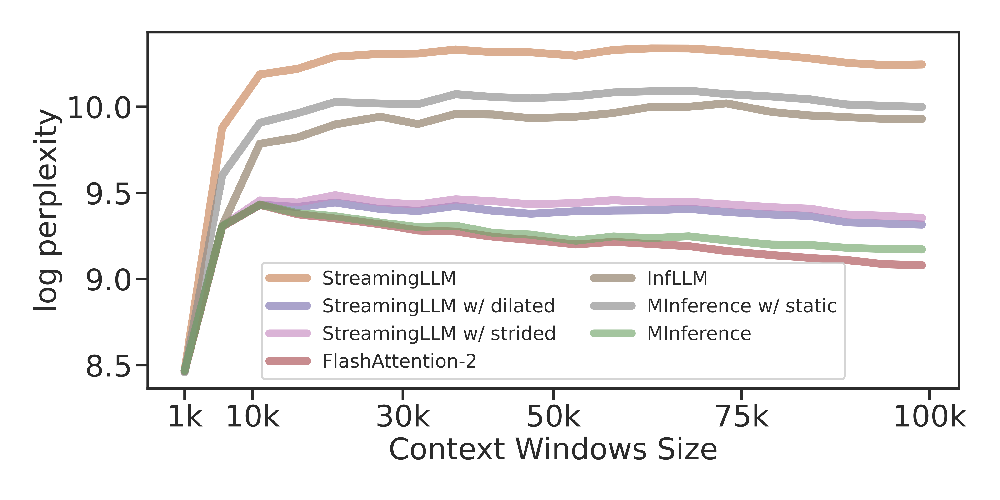
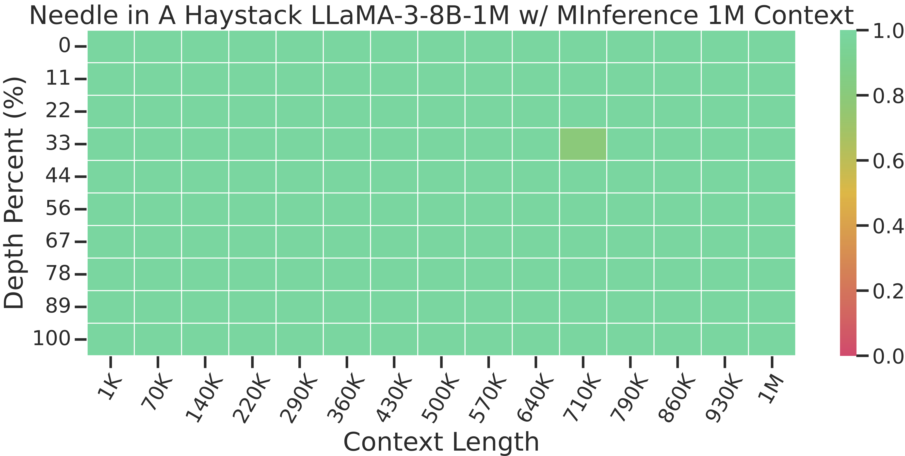

## Offline Kernel-Aware Sparse Pattern Search

You can use the following scripts to search for the optimal head sparse pattern:

```
cd experiments/infinite_bench
python run_infinitebench.py \
    --task kv_retrieval \
    --model_name_or_path gradientai/Llama-3-8B-Instruct-Gradient-1048k \
    --data_dir ./data \
    --output_dir ./results \
    --max_seq_length 30000 \
    --rewrite \
    --is_search \
    --start_example_id 3 \
    --topk_dims_file_path Llama_3_8B_Instruct_262k_kv_out_v32_fit_o_best_pattern.json \
    --num_eval_examples 20 --topk 1 --starting_layer 0 --attn_type minference
```

## MInference Benchmark Experiments

Note: All experiments were run on a single A100 GPU with 80GB of VRAM.

Environment parameters:
- CUDA 12.3
- Triton 2.1.0
- PyCuda 2023.1

### End-to-End Benchmark

To demonstrate the efficiency of our method, we conducted end-to-end latency tests using the [LLaMA-3-8B-Instruct-1M](https://huggingface.co/gradientai/Llama-3-8B-Instruct-Gradient-1048k) model. The prompts were trimmed to different target token numbers, and we measured the pre-filling stage latency without using KV cache.

1. Download the prompt:

```bash
wget https://raw.githubusercontent.com/FranxYao/chain-of-thought-hub/main/gsm8k/lib_prompt/prompt_hardest.txt
```

2. Run a single context window size test using one method:

```bash
python experiments/benchmarks/benchmark_e2e.py --attn_type hf --context_window 1000000
```

3. Run all latency experiments using different methods:

```bash
python experiments/benchmarks/benchmark_e2e.py --run_benchmark
```

4. After that, you should get the end-to-end latency results like this:

```json
        FlashAttention-2 StreamingLLM   InfLLM          MInference
1K      0.54565         1.07110         2.94495         2.96450
10K     0.97590         1.18339         2.21052         2.77618
50K     8.52933         5.47972         14.63624        7.54537
100K    24.88319        10.86379        27.67215        13.98508
200K    79.39184        21.61490        55.64703        26.81303
300K    169.62441       32.44844        80.74326        41.09374
500K    456.78353       54.15910        167.91472       66.27691
1000K   1765.56387      107.85639       328.58551       179.12031
```

### Micro-Benchmark


## MInference Downstream Tasks Experiments

Note: All of these experiments were run on one A100 GPUs with 80GB of VRAM. You may need to modify commands to fit your own computing environment (e.g., changing the batch size, the max memory per GPU, the number of GPUs, etc)

### InfiniteBench

[InfiniteBench](https://github.com/OpenBMB/InfiniteBench) is a benchmark tailored for evaluating the capabilities of language models to process, understand, and reason over super long contexts.

InfiniteBench consists of the following tasks: `kv_retrieval`, `longbook_choice_eng`, `math_find`, `longbook_qa_chn`, `longbook_qa_eng`, `longdialogue_qa_eng`, `code_debug`, `longbook_sum_eng`, `number_string`, `passkey`.

1. Run InfiniteBench with `MInference`:

```bash
bash infinite_bench/run_infinitebench.sh gradientai/Llama-3-8B-Instruct-262k 128000 -1 minference
```

2. Or test InfiniteBench with `FlashAttention-2` via `vLLM`:

```bash
bash infinite_bench/run_infinitebench.sh gradientai/Llama-3-8B-Instruct-262k 128000 -1 vllm
```

3. Experimental results

| Methods       | longbook_sum_eng | longbook_qa_eng | longbook_choice_eng | longdialogue_qa_eng | longbook_qa_chn | code_debug | math_find | passkey | number_string | kv_retrieval | Avg. |
|---------------|------------------|-----------------|---------------------|---------------------|-----------------|------------|-----------|---------|---------------|--------------|------|
| Full Attention| 20.2             | 12.4            | 67.3                | 6.0                 | 12.9            | 22.1       | 26.6      | 100.0   | 100.0         | 14.4         | 38.2 |
| Ours          | **20.5**         | **12.9**        | 65.9            | **7.5**                 | 12.5            | **22.3**       | **33.1**  | 100.0   | 100.0         | 12.8         | **38.8** |

### RULER

The [RULER](https://github.com/hsiehjackson/RULER) benchmark is a challenging long-context LLMs benchmark contains four task categories: Retrieval, Multi-hop Tracing, Aggregation, and Question Answering (QA). The retrieval tasks extend the needle-in-a-haystack (NIAH) test; Multi-hop Tracing involves resolving coreference chains; Aggregation requires identifying frequently occurring words; and QA adapts existing datasets with added distracting information to test models on extended contexts.

To run the RULER benchmark, you need first install the requirements:

```bash
pip install -r ruler/requirements.txt
```

1. Download required data files:

```bash
cd ruler/data/synthetic/json/

# download Paul Graham Essays for the needle test
python download_paulgraham_essay.py

# download SQuAD and HotpotQA for the QA test
bash download_qa_dataset.sh

# you will need nltk.download('punkt') as well
python -c "import nltk; nltk.download('punkt')"
```


2. Run RULER with `MInference` and `Llama-3-8B-Instruct-262k`:

```bash
# under the ruler/ directory
bash run.sh llama-3-262k-minference synthetic
```

The default output dir `results/ruler`, you use `ROOT_DIR` in `run.sh` to change the output dir.

3. Experimental results

| Models       | Claimed | Effective | 4K  | 8K  | 16K | 32K | 64K | 128K | Avg. |
|--------------|---------|-----------|-----|-----|-----|-----|-----|------|------|
| Full-Attention | 262K    | 16K       | 97.2| 91.8| 87.3| 80.8| 77.4| 72.2 | 84.4 |
| Ours         | -       | 32K       | **97.7**| 91.2| **88.5**| **85.0** | **82.3** | **77.6** | **87.0** |


### PPL

We use continues 100K text chunks samples from [PG-19](https://huggingface.co/datasets/deepmind/pg19) for the perplexity evaluation.

1. To run the PPL test, simply run:
```bash
bash ppl/run_ppl.sh
```

The result will be saved at `results/long-ppl/`, and the visualization will be saved as `results/long-ppl/long-ppl-viz.png`.

2. Experimental results




### Needle in A Haystack

The [Needle In A Haystack test](https://github.com/gkamradt/LLMTest_NeedleInAHaystack) is an evaluation method that randomly inserts key information into long texts to form prompts for large language models (LLMs). The test aims to detect whether large models can extract such key information from extensive texts, thereby assessing the models’ capabilities in processing and understanding long documents.

1. Run the Needle in A Haystack test:

```bash
bash needle_in_a_haystack/run_needle.sh
```

The results will be saved under `./needle` directory.

2. Our experimental results


