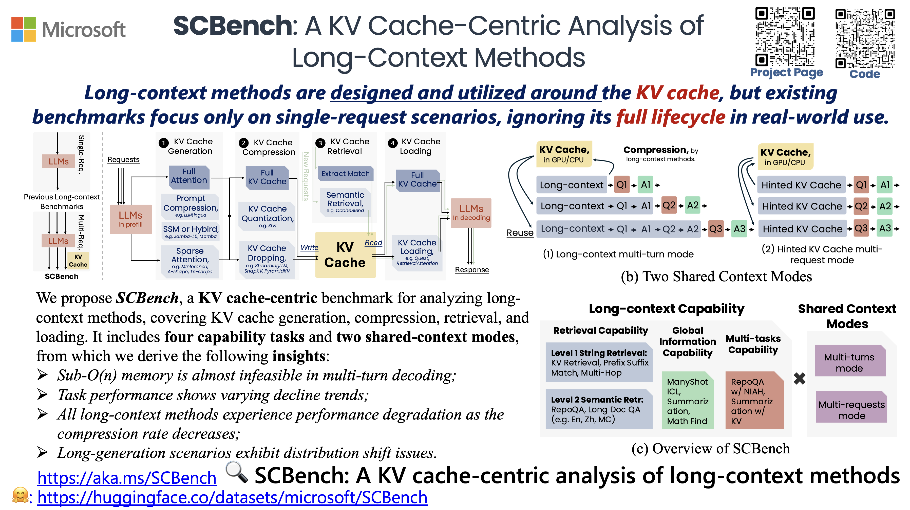

# SCBench

[[Paper]]()
[[Code]](https://github.com/microsoft/MInference/SCBench)
[[Project Page]](https://aka.ms/scbench)



SCBench (SharedContextBench) is a comprehensive benchmark to evaluate efficient long-context methods on **multi-turn** and **multi-request** interactions to analyze their performance across **the full KV cache lifecycle (generation, compression, retrieval, and loading)**.

### Load Data
You can download and load the **SCBench** data through the Hugging Face datasets ([🤗 HF Repo](https://huggingface.co/datasets/microsoft/SCBench)):
```python
from datasets import load_dataset

datasets = ["scbench_kv", "scbench_prefix_suffix", "scbench_vt", "scbench_repoqa", "scbench_qa_eng", "scbench_qa_chn", "scbench_choice_eng", "scbench_many_shot", "scbench_summary", "scbench_mf", "scbench_summary_with_needles", "scbench_repoqa_and_kv"]

for dataset in datasets:
    data = load_dataset('microsoft/SCBench', dataset, split='train')
```

### Data Format

All data in **SCBench** are standardized to the following format:

```json
{
    "id": "Random id for each piece of data.",
    "context": "The long context required for the task, such as repo-code, long-document, and many-shot.",
    "multi_turns": [{"input": "multi-turn question.", "answer": "multi-turn reference answer."}],
}
```

### Experiments

We implement **Multi-Turn** and **Multi-Request** modes with HF and vLLM in [`GreedySearch`](https://github.com/microsoft/MInference/blob/yucheng/kvcompression/scbench/eval_utils.py#L1160) and [`GreedySearch_vllm`](https://github.com/microsoft/MInference/blob/yucheng/kvcompression/scbench/eval_utils.py#L1070) two class. Please refer the follow scripts to run the experiments.


## Run the benchmark

First, build the environment, see [basic environment](#basic-dependencies).

Run the test:

```bash
bash scripts/test_llama.sh
```

Run multiple tasks in one command:

```bash
bash scripts/run_all_tasks.sh
```

Specify the max sequence length, max number of turns, and number of eval examples:

- `--max_seq_length`: The maximum sequence length for the test.
- `--max_turns`: The maximum number of turns for the test.
- `--num_eval_examples`: The number of test examples to use, use all examples in default.

## Run with efficient long-context methods:

- `--attn_type`: The attention type to use.
- `--kv_type`: The KV cache type to use.

For example, run with MInference and SnapKV:

```bash
bash scripts/test_minference_with_snapkv.sh
```

The supported efficient long-context methods are as follows:

**attn_type**:

- `dense`: Dense attention
- `minference`: MInference
- `a_shape`: A-Shape
- `tri_shape`: Tri-Shape

**kv_type**:

- `dense`: Dense KV cache
- `kivi`: KIVI
- `snapkv`: SnapKV
- `quest`: Quest
- `pyramidkv`: PyramidKV
- `streamingllm`: StreamingLLM

You will need to build specific environment for different attention types and KV cache types, see section [Environment](#environment-for-efficient-long-context-methods) for more details.

## Dataset and Tasks Description


SCBench covers 12 diverse tasks that test four key long-context capabilities: string retrieval, semantic retrieval, global information processing, and multi-tasking.

### String Retrieval
- `scbench_kv`: Tests key-value lookup in large JSON objects with random, incompressible content
- `scbench_prefix_suffix`: Evaluates finding strings with specific prefix and suffix patterns
- `scbench_vt`: Assesses multi-hop variable tracing capabilities in long inputs

### Semantic Retrieval
- `scbench_repoqa`: Function retrieval from large codebases based on natural language descriptions
- `scbench_qa_eng`, `scbench_qa_chn`, `scbench_choice_eng`: Includes English QA, Chinese QA, and multi-choice questions on long texts
- Requires semantic understanding on length inputs

### Global Information Processing
- `scbench_many_shot`: Tests in-context learning with hundreds of examples
- `scbench_mf`: Statistical tasks on large arrays
- `scbench_summary`: Summarization of documents
- Requires global information processing or aggregation

### Multi-Tasking
- `scbench_summary_with_needles`: Combines summarization with needle-in-haystack search
- `scbench_repoqa_and_kv`: Integrates code function retrieval with key-value lookup
- Requires multi-tasking or multi-step reasoning

## Two Shared Context Modes
The benchmark evaluates these tasks across two shared context modes:
- **Multi-turn Mode**: the default mode of our SCBench
- **Multi-request Mode**: use `--same_context_different_query` to enable this mode

## Environment for efficient long-context methods

### Basic dependencies:

```bash
conda create -n scbench python=3.10 -y && conda activate scbench
pip install torch
pip install minference
pip install flash-attn --no-build-isolation
git clone https://github.com/microsoft/MInference.git && cd MInference/scbench
pip install -r requirements.txt
```

### (Optional) Environment for efficient long-context methods

MInference natively supports many efficient long-context methods, but you will need to build specific environment for the following methods:

**kivi**:

```bash
bash setup/setup_kivi.sh
```

## Hyper-parameters of efficient long-context methods

### --attn_type

1. **minference**
- `best_pattern` (loaded from config file)

2. **a_shape**
- `n_local` (default: 3968)
- `n_init` (default: 128)

3. **tri_shape**
- `n_local` (default: 3968)
- `n_init` (default: 128)
- `n_last` (default: 100)

### --kv_type

1. **kivi**
- `bits` (default: 2)
- `group_size` (default: 32)
- `residual_length` (default: 32)

2. **snapkv/pyramidkv**
- `window_size` (default: 32)
- `max_capacity_prompt` (default: 4096)
- `kernel_size` (default: 5)
- `pooling` (default: "avgpool")

3. **quest**
- `chunk_size` (default: 16)
- `token_budget` (default: 1024)

4. **streamingllm**
- `n_local` (default: 3968)
- `n_init` (default: 128)


**Note:** All these parameters can be overridden by passing custom values in `--hyper_param` in cli, for example:
```
python run_multiturnbench.py .... --hyper_param '{"n_local": 4096}'
```


## Compared to previous long-context benchmarks


Our SCBench is the first long-context benchmark that covers single-turn, multi-turn, and multi-request scenarios. In addition, our impelmentation also involves KV cache reuse techniques, thereby providing a more comprehensive analysis on the full KV cache lifecycle of efficient long-context methods.


## Citation

```bibtex
@article{li2024scbench,
    title={SCBench: A KV cache-centric analysis of long-context methods},
    author={Li, Yucheng and Jiang, Huiqiang and Wu, Qianhui and Luo, Xufang and Ahn, Surin and Zhang, Chengruidong and Abdi, Amir H and Li, Dongsheng and Gao, Jianfeng and Yang, Yuqing and Qiu, Lili},
    journal={arXiv preprint arXiv:2407.02490},
    year={2024}
}
```
